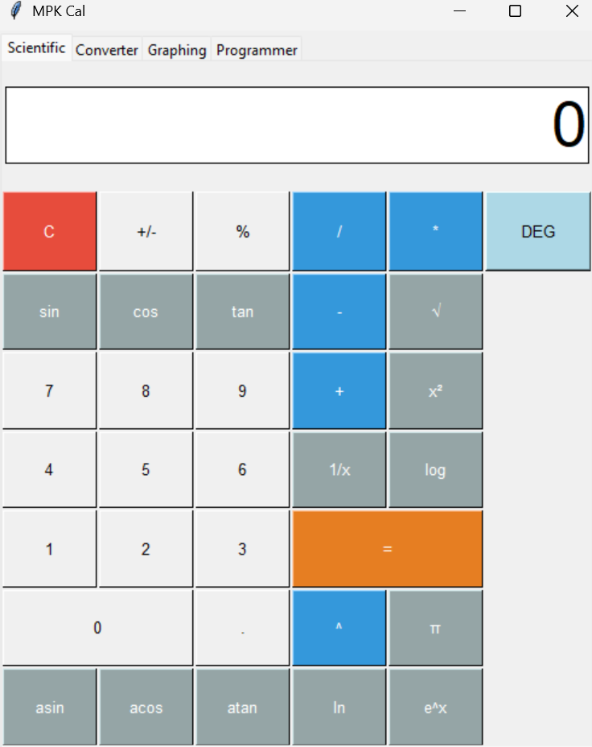
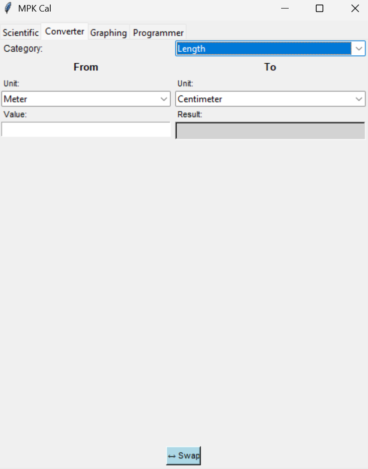
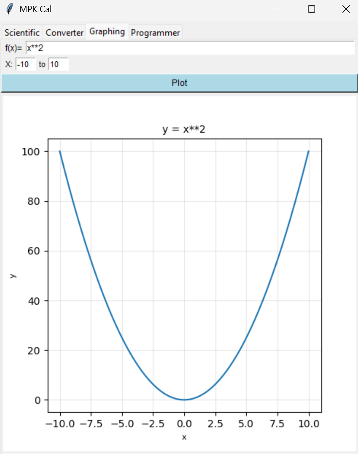
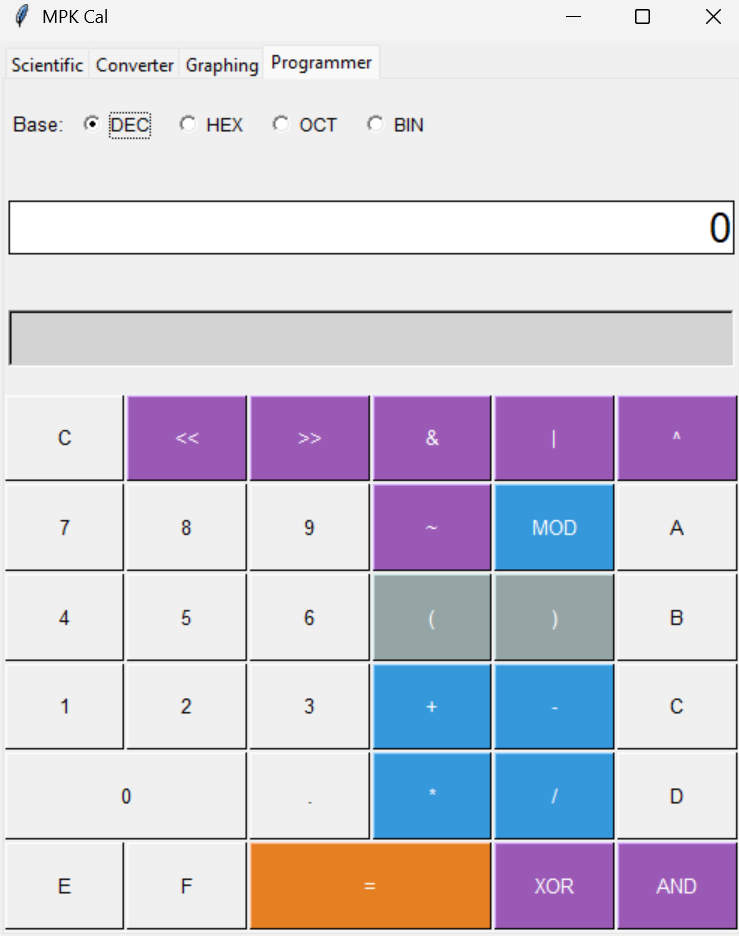

# MPK Calculator

🎉 **My First Python Project!** 🎉

A feature-rich, multi-functional calculator application built with Python and Tkinter. This calculator combines scientific calculations, unit conversions, graphing capabilities, and programmer tools in a single intuitive interface.

This is my first Python project, created to learn GUI development, mathematical operations, and application design!


## Features

### 🔢 Scientific Calculator
- Basic arithmetic operations (+, -, ×, ÷)
- Advanced functions (sin, cos, tan, log, ln, sqrt)
- Inverse trigonometric functions (asin, acos, atan)
- Power operations (x², x^y)
- Constants (π, e)
- DEG/RAD mode toggle
- Percentage calculations
- Sign toggling (+/-)

### 🔄 Unit Converter
- **Length**: Meter, Centimeter, Kilometer, Inch, Foot
- **Mass**: Kilogram, Gram, Pound, Ounce
- **Volume**: Liter, Milliliter, Gallon, Pint
- **Temperature**: Celsius, Fahrenheit, Kelvin
- Quick swap functionality between units
- Real-time conversion as you type

### 📊 Graphing Calculator
- Plot mathematical functions
- Customizable X-axis range
- Support for numpy and math functions
- Interactive visualization
- Grid and axis labels

### 💻 Programmer Calculator
- Multiple number bases (DEC, HEX, OCT, BIN)
- Bitwise operations (&, |, ^, ~, <<, >>)
- 32-bit representation display
- Modulo operation
- Integer arithmetic

## Installation

### Prerequisites
- Python 3.7 or higher
- pip (Python package installer)

## Screenshots

### Scientific Calculator


### Unit Converter


### Graphing Calculator


### Programmer Calculator


## Project Structure

```
mpk-calculator/
│
├── calculator.py          # Main Application File
├── README.md              # This file
└── assets/                # Screenshots & banner
    ├── scientific.png
    ├── converter.png
    ├── graph.png
    └── programmer.png
```

### Required Libraries

```bash
pip install numpy matplotlib
```

Note: `tkinter` comes pre-installed with most Python distributions.

### Clone the Repository

```bash
git clone https://github.com/yourusername/mpk-calculator.git
cd mpk-calculator
```

## Usage

Run the application:

```bash
python calculator.py
```

### Scientific Calculator Tab
1. Click number buttons to input values
2. Select an operator (+, -, ×, ÷, ^)
3. Input the second number
4. Press = to calculate
5. Use DEG/RAD button to switch angle modes for trigonometric functions

### Converter Tab
1. Select a category (Length, Mass, Volume, Temperature)
2. Choose "From" and "To" units
3. Enter the value to convert
4. Result appears automatically
5. Use the Swap button to reverse conversion

### Graphing Tab
1. Enter a mathematical function (e.g., `x**2`, `sin(x)`, `exp(x)`)
2. Set X-axis minimum and maximum values
3. Click "Plot" to visualize the function

### Programmer Tab
1. Select number base (DEC, HEX, OCT, BIN)
2. Input numbers (hex digits A-F available when in HEX mode)
3. Use arithmetic or bitwise operators
4. View 32-bit binary representation in real-time

## Supported Functions in Graphing

- Basic: `+`, `-`, `*`, `/`, `**` (power)
- Trigonometric: `sin()`, `cos()`, `tan()`
- Exponential/Logarithmic: `exp()`, `log()` (natural log)
- Constants: `pi`
- Numpy functions: prefix with `np.` (e.g., `np.sqrt(x)`)


## Dependencies

```
numpy>=1.19.0
matplotlib>=3.3.0
```

## Contributing

Contributions are welcome! Please feel free to submit a Pull Request.

1. Fork the repository
2. Create your feature branch (`git checkout -b feature/AmazingFeature`)
3. Commit your changes (`git commit -m 'Add some AmazingFeature'`)
4. Push to the branch (`git push origin feature/AmazingFeature`)
5. Open a Pull Request

## Future Enhancements

- [ ] History/Memory functions
- [ ] More unit categories (Speed, Energy, etc.)
- [ ] Export graph images
- [ ] Custom color themes
- [ ] Keyboard shortcuts
- [ ] Equation solver
- [ ] Matrix operations

## Learning Journey

This project was created as my first Python application! Through building this calculator, I learned:

- **GUI Development**: Working with Tkinter to create interactive interfaces
- **Object-Oriented Programming**: Organizing code into classes and methods
- **Event Handling**: Responding to button clicks and user inputs
- **Mathematical Libraries**: Using NumPy and Matplotlib for calculations and graphing
- **Error Handling**: Managing exceptions and providing user-friendly error messages
- **Multi-tab Interfaces**: Creating organized, feature-rich applications

As my first project, it taught me the fundamentals of Python programming and gave me the confidence to tackle more complex projects in the future!

## Known Issues

- Temperature conversion requires selecting the Temperature category specifically
- Graph plotting limited to single-variable functions
- Programmer mode uses 32-bit integer representation

## License

This project is licensed under the MIT License - see the LICENSE file for details.

## Author

**Your Name** - *First Python Project*
- GitHub: [@mahimapaseda](https://github.com/mahimapaseda)
- Email: mahimapasedakusumsiri@gmail.com

💡 *I'm a beginner Python developer, and this is my first project! Feel free to reach out with suggestions or feedback.*

## Acknowledgments

- Built with Python's Tkinter library
- Graphing powered by Matplotlib
- Scientific calculations using NumPy and Python's math module
- Special thanks to the Python community for excellent documentation and tutorials that helped me complete my first project!

---

⭐ If you found this project helpful, please give it a star! This is my first Python project, and your support means a lot!
